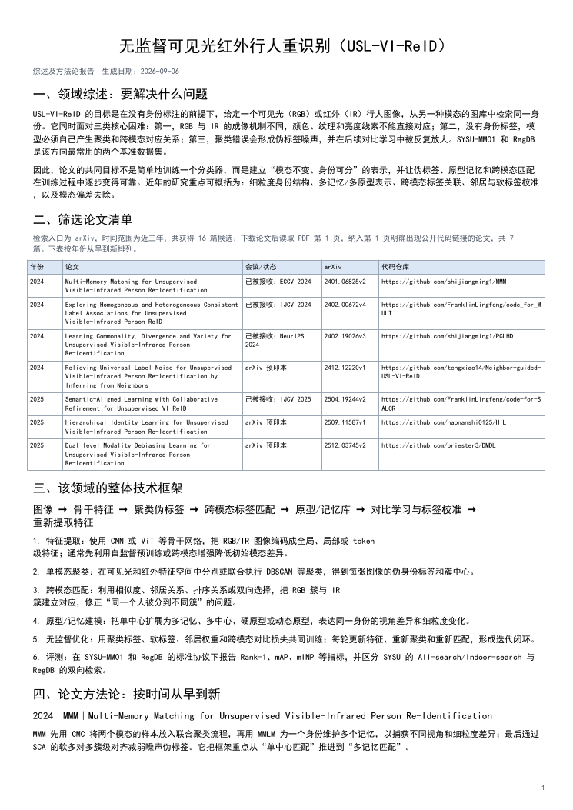
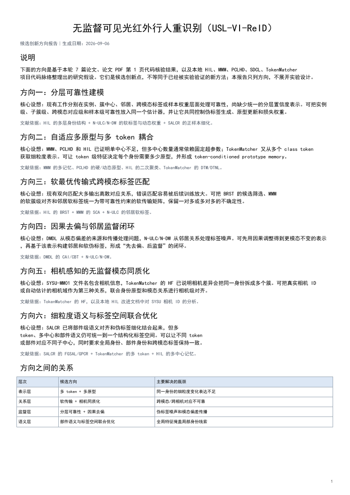

# Auto Paper

[](LICENSE)
[](pyproject.toml)

Auto-Paper is an evidence-first literature-review agent available as a CLI, MCP server, and Codex plugin. It verifies paper accessibility and public code links, then produces survey, screening, method-evolution, and research-idea reports.

它把原先需要手动完成的检索、筛选、代码链接核验、证据整理和报告导出串成一条可复跑的流程。当前预置领域是无监督可见光-红外跨模态行人重识别（USL-VI-ReID），主要数据集为 `SYSU-MM01` 和 `RegDB`。

## 工作流

流程固定生成四个分析模块：

1. 领域综述
2. 论文清单和筛选理由
3. 方法演化
4. 有文献依据的创新方向

默认 CLI 使用 arXiv 公开论文，并在下载后的 PDF 第 1 页（标题/摘要页）核验公开代码链接；文本中的换行链接和页面内嵌超链接都会检查。指标、趋势和创新候选应通过 `Evidence` 记录回溯到论文原文，不允许用模型补齐缺失数值。

导出文件包括：

- `review.md` / `review.json`：可读报告和结构化结果
- `review.xlsx`：论文及指标表
- `综述及方法论.pdf`：领域问题、筛选清单、统一流程和逐篇方法
- `创新方向.pdf`：候选研究方向及其文献依据

## 产出示例

下面两页来自一次 USL-VI-ReID 调研产出，分别展示方法综述与候选创新方向。





## CLI

```powershell
pip install -e ".[export,dev]"
auto-paper "visible infrared cross-modal person re-identification" --limit 50 --out artifacts
```

直接运行 CLI 的模型分析需要一个 OpenAI-compatible API：

```powershell
$env:OPENAI_API_KEY = "your-key"
$env:OPENAI_BASE_URL = "https://api.openai.com/v1"
$env:OPENAI_MODEL = "your-model"
$env:GITHUB_TOKEN = "optional-github-token"
auto-paper "visible infrared cross-modal person re-identification" --limit 50 --out artifacts
```


## Agent 模式

Codex 或其他支持 MCP 的宿主可以使用自己的当前模型完成分析，不需要再给工作流配置一个模型 key：

```powershell
pip install -e ".[export,agent]"
auto-paper-mcp
```

MCP 工具包括：

- `prepare_review_materials`：收集候选论文、公开代码链接、全文材料和排除理由
- `run_literature_review`：在 MCP 进程已配置模型 API 时直接完成分析
- `export_agent_review`：把宿主 Agent 生成的结构化结果导出为 Markdown、JSON、Excel 和 PDF

## Codex 插件

仓库包含一个可从 Git marketplace 安装的自包含插件。使用者需要 Python 3.10+：

```text
codex plugin marketplace add Ljia-liang/auto-paper
codex plugin add auto-paper-review@auto-paper
```

marketplace 注册后，安装 `auto-paper-review` 并新建 Codex 任务即可加载它的 Skill 和 MCP 工具。首次调用会在用户缓存目录创建隔离环境并安装依赖，后续启动会复用该环境。


## 已知局限与设计取舍

- **领域预置**：默认配置和 CLI 的 arXiv 检索式面向 USL-VI-ReID。虽然接受 `--domain`，迁移到其他领域仍需调整检索与报告规则；这是先固定评测口径、换取通用性的取舍。
- **PDF 解析脆弱**：当前使用文本层解析，没有 OCR 和复杂版面恢复。扫描版、双栏或公式密集 PDF 可能提取不完整；单篇失败不会中断整批流程，但会减少可用证据。
- **模型上下文有上限**：CLI 会把多篇论文摘录合并分析并限制输入片段与输出长度。论文越多，耗时和 token 通常越高；截断也可能遗漏后文表格或方法细节。


## License

[MIT](LICENSE)
